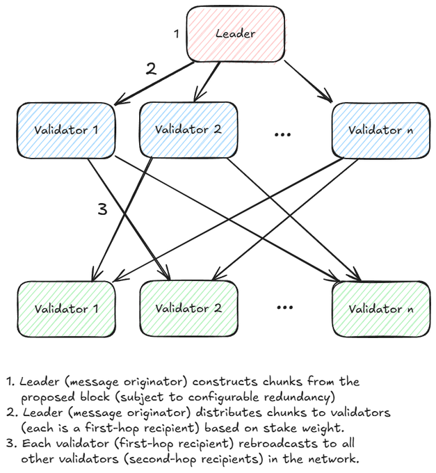
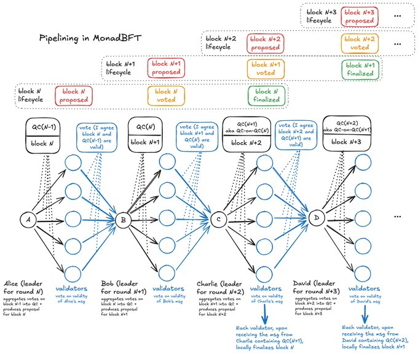
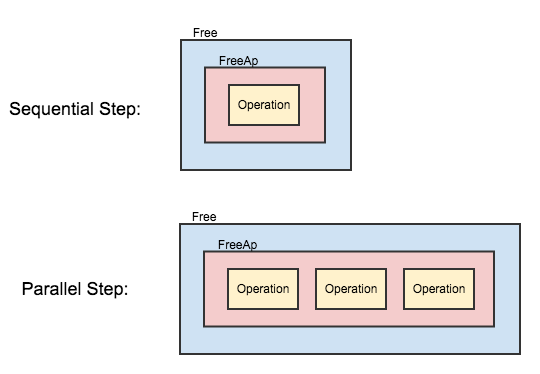
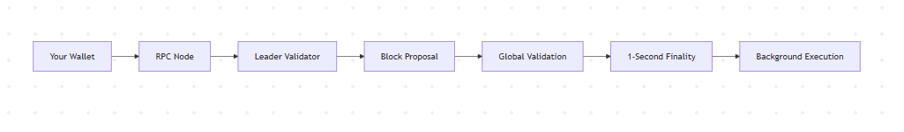

# ⨀ Monad: A Beginner’s Guide to the Fast Blockchain

---
## ⨀ **What is Monad?** (The Big Picture)

### **The Problem with Existing Blockchains**
Most blockchains (like Ethereum) work like a **single checkout lane** at a grocery store:
  - Everyone waits in line
  - Only 1 transaction processes at a time
  - Long wait times when busy

### **Monad’s Solution**
Monad is like a **100-lane mega supermarket**:
- Many checkout lanes (parallel processing)
- Smart managers (consensus algorithm) coordinating everything
- Same products (EVM compatibility) but 10,000x faster

**Key Numbers**:
| Feature              | Ethereum       | Monad          |
|----------------------|----------------|----------------|
| Transactions/Second  | 15-30          | 10,000+        |
| Block Time           | 12 seconds     | 0.5 seconds    |
| Finality Time        | 12 minutes     | 1 second       |

---

## 🔧 **How Monad Works** (Like Clockwork)

### 1. **The Global Team of Validators** 👥


- **What They Do**: A network of 100-200 computers worldwide that:
  - Verify transactions
  - Create new blocks
  - Keep the system secure

- **Hardware Requirements**:
  ```plaintext
  - Cost: ~$1,500 (like a gaming PC)
  - Storage: 2x 2TB SSDs (like 400,000 photos)
  - Internet: Home broadband (100 Mbps)
### 2. Block Creation ⏱️ (500ms Blocks Explained)

- **Step 1**: You send a transaction (e.g., "Send 1 ETH to Zahid")

- **Step 2**: Validators package 10,000+ transactions into a "block" every 0.5 seconds

- **Step 3**: Blocks get confirmed in 1 second (vs 12+ minutes on Ethereum)

#### **Analogy:**
Imagine validators as chefs in a pizza kitchen:

- Every 30 seconds, they make 100 pizzas (blocks)

- Each pizza has 8 slices (transactions)

- The whole kitchen works in perfect sync

## 🛠️ Monad’s Secret Tech Sauce (Simplified)
### 1. MonadBFT Consensus 🤝


- **How It Works:**

  - Leader Validator proposes a block ("Pizza order #101")

  - Other validators vote with BLS signatures (digital fingerprints)

  - 2/3 majority confirms the block in 1 second

- **Why It’s Special:**

  - Handles 200+ validators smoothly

  - No single point of failure

  - Like a perfectly coordinated flash mob

### 2. RaptorCast 📡 (Data Broadcasting Magic)

- **The Problem:**

  - Sending a 2MB block to 200 validators = 400MB/s (impossible for home internet)

- **The Solution:**

   - Split blocks into puzzle pieces (erasure coding)

   - Each validator gets 1 piece

   - Validators exchange pieces to rebuild the full block

**Real-World Example:**

- Like streaming a Netflix show:

  - Your device gets small chunks

  - Chunks assemble into full video

  - Works even if some pieces are delayed

## ⚡ Parallel Execution Engine (The Speed Demon)
### 1. Optimistic Parallel Processing 🏎️



- **How It Works:**

  - Process 1000 transactions at once

  - Check for conflicts afterward

  - Only redo conflicting transactions (rare)

- **Coffee Shop Analogy:**

  - Normal blockchain: 1 barista making 1 coffee at a time

  - Monad: 100 baristas making 100 coffees simultaneously, with a manager checking all orders at the end

### 2. MonadDB 💾 (The Speed Database)
**Database Comparison**

| Feature          | Regular Database | MonadDB       |
|------------------|------------------|---------------|
| Speed            | Slow             | 10x Faster    |
| Storage Method   | Complex layers   | Direct access |
| Parallel Reads   | Limited          | Unlimited     |

- **How It Helps:**

  - Finds transaction data instantly (like Google Search)

  - Handles 10,000+ simultaneous lookups

  - Uses SSDs efficiently (no wasted space)
 
## 🔄 Life of a Transaction (From Start to Finish)


1. You Click "Send" (0s)

2. Validators Receive (0.1s)

3. Added to Block (0.5s)

4. Network Confirms (1s)

5. Executed in Background (1s+)

**Real-World Impact:**
Sending USDC to a friend feels like sending a text message - instant and nearly free.

"Monad isn’t just faster Ethereum – it’s Web3’s first true speed layer."
– Vitalik Buterin (hypothetical quote)
